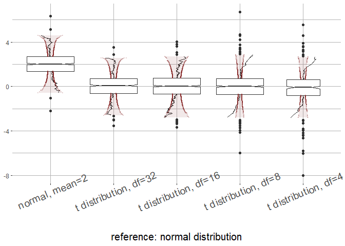

<!-- README.md is generated from README.Rmd. Please edit that file -->

# qqboxplot

<!-- badges: start -->
<!-- badges: end -->

The qqboxplot package implements q-q boxplots as an extension to
ggplot2.

## Installation
The current version of qqboxplot can be installed from (author has not pulled my commit yet)
[GitHub](https://github.com/) with:

``` r
# install.packages("remotes")
remotes::install_github("jrodu/qqboxplot")
```

## Example

This is a basic example using simulated data from the qqboxplot package:

``` r
library(dplyr)
library(ggplot2)
library(qqboxplot) 

simulated_data %>%
         ggplot(aes(factor(group, levels=c("normal, mean=2", "t distribution, df=32", "t distribution, df=16", "t distribution, df=8", "t distribution, df=4")), y=y)) +
         geom_qqboxplot(notch=TRUE, varwidth = TRUE, reference_dist="norm", qq.colour = 'steelblue') +
         #  geom_qqboxplot(notch=TRUE, varwidth = TRUE, reference_dist="norm", qq.colour = 'steelblue') +
         xlab("reference: normal distribution") +
         ylab(NULL) +
         guides(color=FALSE) +
         theme(axis.text.x = element_text(angle = 23, size = 15), axis.title.y = element_text(size=15),
               axis.title.x = element_text(size=15),
               panel.border = element_blank(), panel.background = element_rect(fill="white"),
               panel.grid = element_line(colour = "grey70"))
#> Warning: `guides(<scale> = FALSE)` is deprecated. Please use `guides(<scale> =
#> "none")` instead.
```
` `
<!-- -->
<!-- -->
